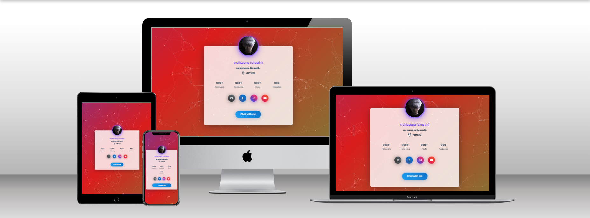

# PERSONAL PAGE THEME

### 📥 Download
**Clone the repository:**
```bash
git clone https://github.com/trchicuong/profile-page.git
```
Or download the `.zip` file from the repository.

### ✨ Usage
The HTML code is very simple and optimized for the fastest possible website performance. You only need to download a code editor (e.g., VS Code) to be able to edit the code.

### 📸 Screenshot
